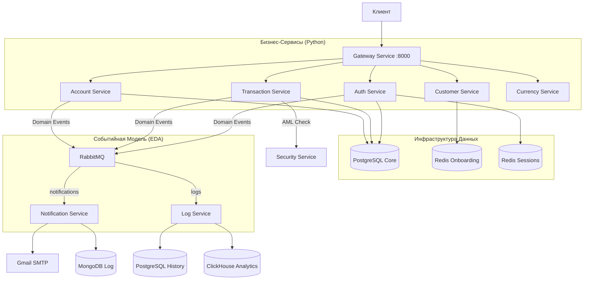

# Банковская Платформа (Backend)


Централизованная банковская экосистема, построенная на микросервисной архитектуре. Система реализует современные архитектурные паттерны: **Domain-Driven Design (DDD)**, **Unit of Work**, **CQRS** и **Event-Driven Architecture (EDA)**.

## Файловая архитектура

```text
backend/
├── account_service/      # Жизненный цикл банковских счетов
├── auth_service/         # Аутентификация, сессии и безопасность
├── currency_service/     # Валютные котировки и конвертация
├── customer_service/     # Управление профилями клиентов (KYC)
├── gateway_service/      # API Gateway (Go / Echo)
├── log_service/          # Централизованный аудит и аналитика
├── notification_service/ # Система уведомлений (Email)
├── security_service/     # Антифрод-мониторинг и AML
├── metal_service/        # Котировки драгоценных металлов
├── shared/               # Ядро инфраструктуры (DB, RabbitMQ, Utils)
├── migrations/           # Управление схемами баз данных
├── README.md             # Общий обзор системы
└── Patterns.md           # Архитектурные стандарты и паттерны
```

## Технологический Стек

-   **Языки**: Go 1.23 (Gateway), Python 3.12 (Бизнес-логика).
-   **Фреймворки**: Echo (Go), FastAPI (Python).
-   **Хранилища**: 
    - PostgreSQL 17 (Core & History)
    - Redis Stack (Sessions & Onboarding)
    - MongoDB 7 (Logs)
    - ClickHouse 24 (Analytics)
-   **Брокер**: RabbitMQ 3.13.
-   **Контейнеризация**: Docker, Docker Compose.

---

## Архитектура Системы



---

## Описание Сервисов

### 1. Gateway Service (Go)
Единая точка входа. Выполняет маршрутизацию, динамическую валидацию UUID, проверку сессий в Redis и блокировку по PIN-коду. Обеспечивает безопасность внутренних вызовов через инъекцию `X-Internal-Key`.

### 2. Account Service
Управление жизненным циклом счетов. Реализует логику генерации 20-значных номеров по банковскому стандарту, управление лимитами по валютам и каскадные блокировки аккаунтов.

### 3. Transaction Service
Финансовое ядро системы. Гарантирует атомарность операций через паттерн Unit of Work, предотвращает взаимные блокировки (Deadlocks) и обеспечивает идемпотентность платежей.

### 4. Auth Service
Сервис безопасности и контроля доступа. Отвечает за bcrypt-хеширование PIN-кодов, управление жизненным циклом сессий в Redis и автоматическую блокировку при признаках Brute-force.

### 5. Customer Service
Управление данными пользователей и KYC. Реализует пошаговый онбординг с сохранением промежуточных состояний в Redis Stack и шифрованием персональных данных (PII).

### 6. Security Service (AML/CFT)
Выполняет превентивный анализ транзакций по набору правил (Large Tx, Rapid Fire, Structuring). Позволяет автоматически замораживать счета при обнаружении подозрительной активности.

### 7. Notification & Log Services
Асинхронные потребители событий. `Notification` обеспечивает коммуникацию с клиентом, а `Log` реализует дуальную запись для аудита (Postgres) и бизнес-аналитики (ClickHouse).

---

## Безопасность

Проект реализует многоуровневую систему защиты:
1.  **Transport**: Изоляция сервисов во внутренней Docker-сети.
2.  **Authentication**: Проверка `X-Session-Token` на уровне Middleware.
3.  **Authorization**: Доступ к финансовым операциям защищен PIN-gate.
4.  **Integrity**: Межсервисное взаимодействие валидируется через `X-Internal-Key`.

---

## Документация
- **[Инфраструктура и запуск](../infra/README.md)**
- **[Архитектурные паттерны](./Patterns.md)**
- **[API & AML Стандарты](../infra/docs/api_standards.md)**
