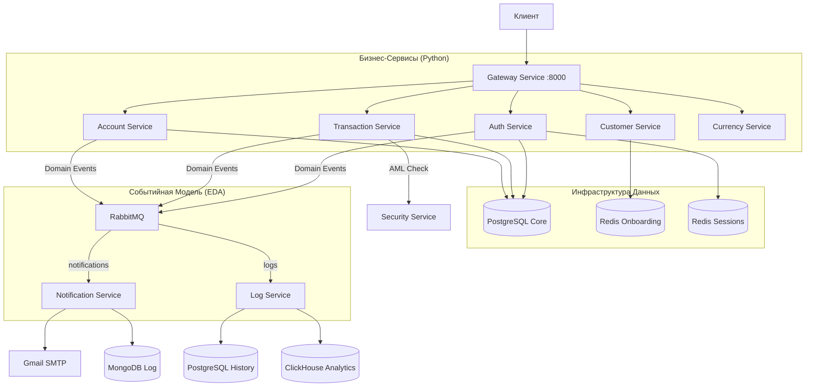

# Банковская Платформа (Backend)

Банковский бэкенд, построенный на микросервисной архитектуре с использованием Python (FastAPI) и Go (Echo). Система реализует паттерны **DDD**, **Unit of Work**, **CQRS** и **Event-Driven Architecture (EDA)**.

## Файловая архитектура
```
backend/
├── account_service/      # Управление счетами
├── auth_service/         # Сессии и безопасность (PIN)
├── currency_service/     # Курсы валют и конвертация
├── customer_service/     # Данные клиентов и KYC
├── gateway_service/      # API Gateway (Go)
├── log_service/          # Аудит и аналитика (Consumer)
├── notification_service/ # Email-уведомления (Consumer)
├── security_service/     # AML / Антифрод
├── metal_service/        # Котировки металлов
├── shared/               # Ядро: DB, RabbitMQ, Utils
├── migrations/           # Схемы БД и Alembic
├── README.md             # Общий обзор системы
└── Patterns.md           # Архитектурные стандарты
```

## Технологический Стек

- **Языки**: Go 1.23 (Gateway), Python 3.12 (Бизнес-логика).
- **Фреймворки**: Echo (Go), FastAPI (Python).
- **Базы Данных**: PostgreSQL 17 (Core), PostgreSQL 17 (History), Redis Stack (JSON/Onboarding), MongoDB 7, ClickHouse 24.
- **Брокер**: RabbitMQ 3.13.
- **Архитектура**: 4-слойная структура (API -> Service -> UoW -> Repository).
- **Контейнеризация**: Docker, Docker Compose.
- **Безопасность**: bcrypt, X-Internal-Key, PIN-gate, Rate-limiting.

---

## Архитектура Системы



---

## Описание Сервисов

### 1. Gateway Service (Go)
Единая точка входа. Выполняет маршрутизацию, проверку сессий в Redis и блокировку по PIN-коду. Обеспечивает безопасность внутренних вызовов через инъекцию `X-Internal-Key`.

### 2. Account Service
Управление жизненным циклом счетов.
- **API**: `/accounts`, `/accounts/{id}/suspensions`.
- **Логика**: Генерация 20-значных номеров, лимиты по валютам, каскадные блокировки.
- **CQRS**: Оптимизированное чтение списка счетов через Query Layer.

### 3. Transaction Service
Финансовое ядро системы.
- **API**: Единый эндпоинт `POST /transactions` (тип: `transfer`, `deposit`, `withdrawal`).
- **Свойства**: Атомарность через UoW, предотвращение Deadlocks, идемпотентность.
- **Security**: Принудительная AML-проверка перед каждой операцией.

### 4. Auth Service
Аутентификация и управление доступом.
- **API**: `/auth/login`, `/pins`, `/unlock-codes`.
- **Механизмы**: bcrypt-хеширование, сессии в Redis, автоматическая блокировка при переборе PIN.

### 5. Customer Service
Управление данными пользователей и онбординг.
- **API**: `/onboarding`, `/personal-data`, `/passports`.
- **Логика**: Пошаговая регистрация (4 шага) с сохранением черновиков в Redis Stack.

### 6. Security Service (AML/CFT)
Внутренний сервис антифрода. Проверяет транзакции по 6 правилам и осуществляет системную заморозку подозрительных счетов.

### 7. Notification & Log Services
Асинхронные воркеры (Consumers).
- **Notification**: Отправка Email по шаблонам, ведение журнала в MongoDB.
- **Log**: Дуальная запись событий в PostgreSQL (аудит) и ClickHouse (аналитика).

---

## Аутентификация и Безопасность

Проект реализует **трёхуровневую** защиту:
1.  **Сессия**: `X-Session-Token` проверяется в Gateway.
2.  **PIN-gate**: Доступ к финансовым роутам только после успешного ввода PIN.
3.  **Внутренний ключ**: Каждый микросервис проверяет `X-Internal-Key`, гарантируя, что запрос пришел от Gateway.

---

## Запуск Системы

Подробные инструкции по развертыванию инфраструктуры и локальному запуску находятся в документе:
**[README Инфраструктуры](../infra/README.md)**

---

## Паттерны и Стандарты
Полный перечень архитектурных решений, конвенций кода и правил обработки ошибок зафиксирован в:
**[Patterns.md](./Patterns.md)**
