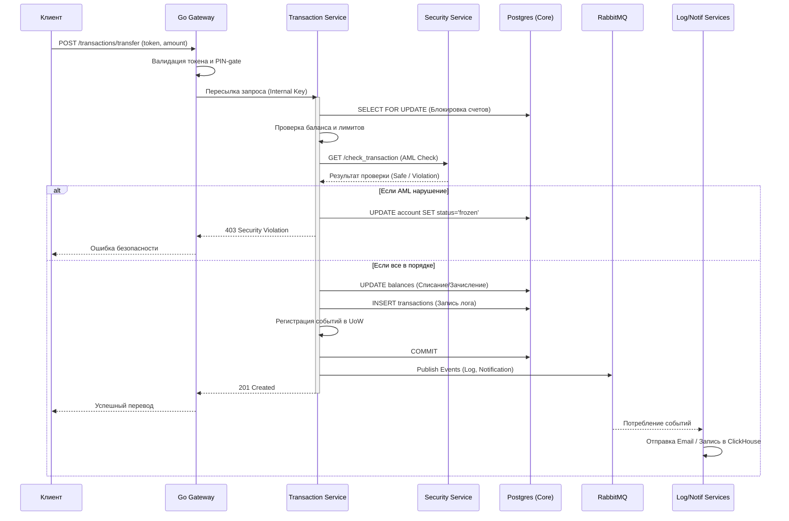
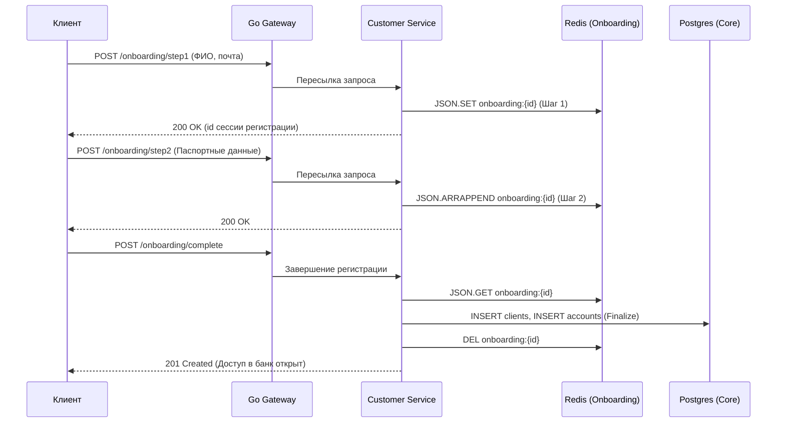

# Сценарии использования (Business Flows)

В этом разделе представлены детальные схемы прохождения данных через систему для ключевых бизнес-процессов.

## 1. Процесс финансовой транзакции (Перевод)

Схема показывает путь запроса на перевод средств между счетами, включая проверки безопасности и асинхронное уведомление участников.

## 2. Пошаговая регистрация (KYC Onboarding)

Процесс регистрации разделен на этапы для удобства пользователя. Промежуточное состояние хранится в Redis.

## 3. Мониторинг и Аудит

Все действия пользователей в системе проходят через "дуальную запись":
1.  **Синхронно**: Обновление баланса в Postgres Core для гарантированной точности.
2.  **Асинхронно**: Через RabbitMQ событие попадает в `Log Service`, который сохраняет данные в **ClickHouse** для бизнес-аналитики и в **Postgres History** для юридического аудита.
