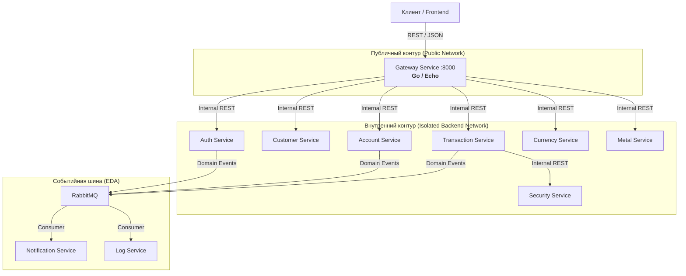

# Верхнеуровневая архитектура (High-Level Design)

Система представляет собой распределенную микросервисную платформу, спроектированную для обеспечения высокой доступности, безопасности и масштабируемости.

## 🏗️ Общая схема взаимодействия

Взаимодействие компонентов построено на комбинации синхронных (REST) и асинхронных (EDA) вызовов.

## 🛡️ Топология сети и Изоляция (Zero Trust)

Архитектура следует принципу **Zero Trust** и многоуровневой изоляции:

1.  **Gateway (Единая точка входа)**: Единственный сервис, доступный из внешней сети. Написан на **Go**, что обеспечивает минимальные задержки при проксировании и высокую устойчивость к нагрузкам.
2.  **Сетевая изоляция**: Все микросервисы (FastAPI) находятся в изолированной Docker-сети `backend`. Прямой доступ к ним снаружи невозможен.
3.  **Идентификация вызовов**: Каждый межсервисный запрос валидируется через заголовок `X-Internal-Key`. Даже если злоумышленник попадет во внутреннюю сеть, он не сможет выполнить запрос к сервису без секретного ключа.

## 🧩 Зоны ответственности компонентов

### API Gateway (Go)
- Маршрутизация запросов к соответствующим микросервисам.
- Первичная проверка сессий в Redis.
- Реализация PIN-gate для чувствительных операций.
- Обогащение заголовков (инъекция `X-User-ID`).

### Бизнес-сервисы (FastAPI / Python)
- Реализация специфической доменной логики (счета, транзакции, котировки).
- Использование **Unit of Work** для обеспечения атомарности.
- Генерация доменных событий при изменении состояния.

### Инфраструктурные сервисы (FastAPI / Python)
- **Log Service**: Асинхронный аудит действий и запись в аналитическое хранилище ClickHouse.
- **Notification Service**: Отправка уведомлений через различные каналы (Email, и т.д.).
- **Security Service**: Превентивный анализ транзакций (AML/Anti-fraud).

---
*См. также:*
- [Архитектурные паттерны](./patterns.md)
- [Стратегия работы с данными](./data_strategy.md)
