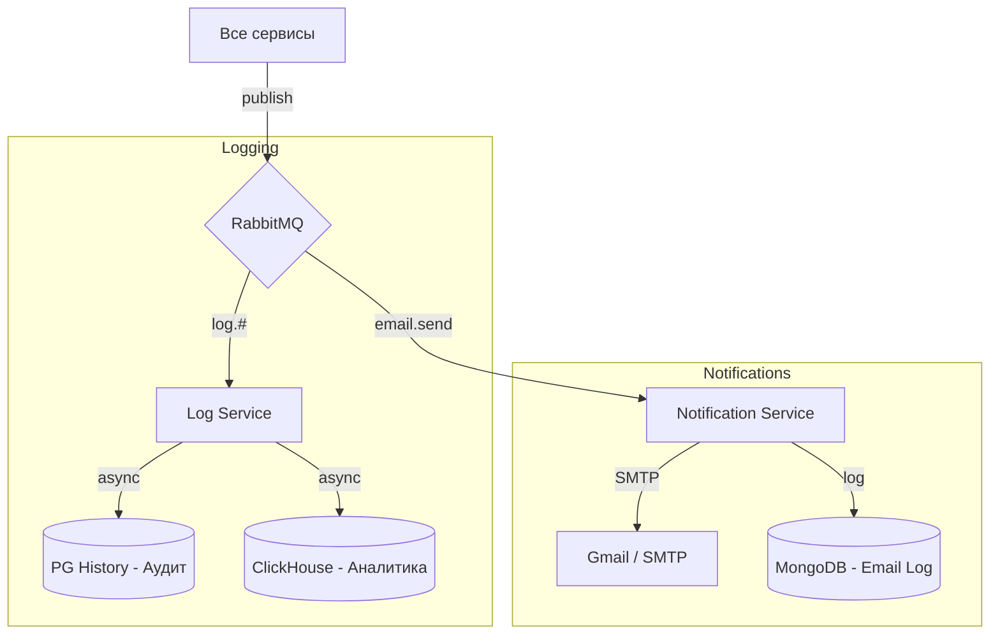

# Карта событий (Event-Driven Architecture)

Приложение использует RabbitMQ для асинхронной коммуникации через два основных Exchange.

## Exchange: `logs` (Topic)

Используется всеми сервисами для записи аудит-лога действий пользователей и аналитики бизнес-событий.

- **Publisher:** Все микросервисы (auth, customer, transaction, account и др.)
- **Consumer:** `log_service` (Queue: `log_queue`)
- **Routing Keys:** 
  - `log.auth` — Аудит безопасности (вход, блок, смена PIN)
  - `log.account` — Действия со счетами (открытие, закрытие, заморозка)
  - `log.transaction` — Финансовые операции (депозит, снятие, перевод)
  - `log.onboarding` — Этапы регистрации

## Exchange: `notifications` (Direct)

Используется для отправки уведомлений клиентам (Email).

- **Publisher:** Все микросервисы
- **Consumer:** `notification_service` (Queue: `email_queue`)
- **Routing Key:** `email.send`
- **Payload:** JSON с указанием `type` (имя шаблона) и `variables` (данные для подстановки).

## Поток данных (Data Flow)

### Хранение событий:
| Хранилище      | Тип       | Назначение                          | TTL      |
|:---------------|:----------|:------------------------------------|:---------|
| **PostgreSQL** | История   | Полный аудит действий пользователей | —        |
| **ClickHouse** | Аналитика | Статистика по финансовым событиям   | 2 года   |
| **MongoDB**    | Уведомления| Журнал отправленных писем          | 90 дней  |
